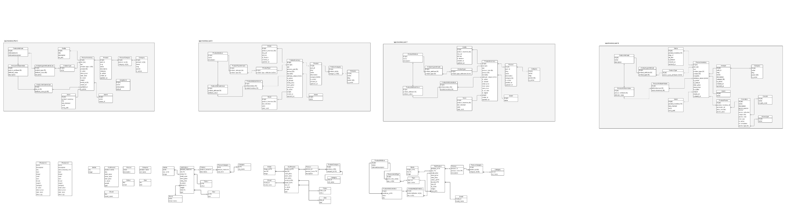

# Ecommerce Page

This is an ecommerce web site based on Zander's E-commerce project v2
[Django E-commerce Project v2](https://youtu.be/EbLEyM9SyZQ?si=ZWv0Ha6-doBYVMPU)

## Technology Stack

- Python 3.12
- Django 5.1.1
- PostgreSQL
- Pytest and pytest-django
- pytest factory boy
- pytest selenium

## Docker

- build docker image:
  `docker build -t ecommerce .`
- run docker image
  `docker run -p 8888:8000 ecommerce`
- clean docker resources
  `docker system prune`
- run with docker-compose
  `docker compose up`

## Database Design

At the moment we are using a single database for all the data.

## Testing

We are using Factory Boy to generate test data. We are also using data fixtures to populate the database with test data.

